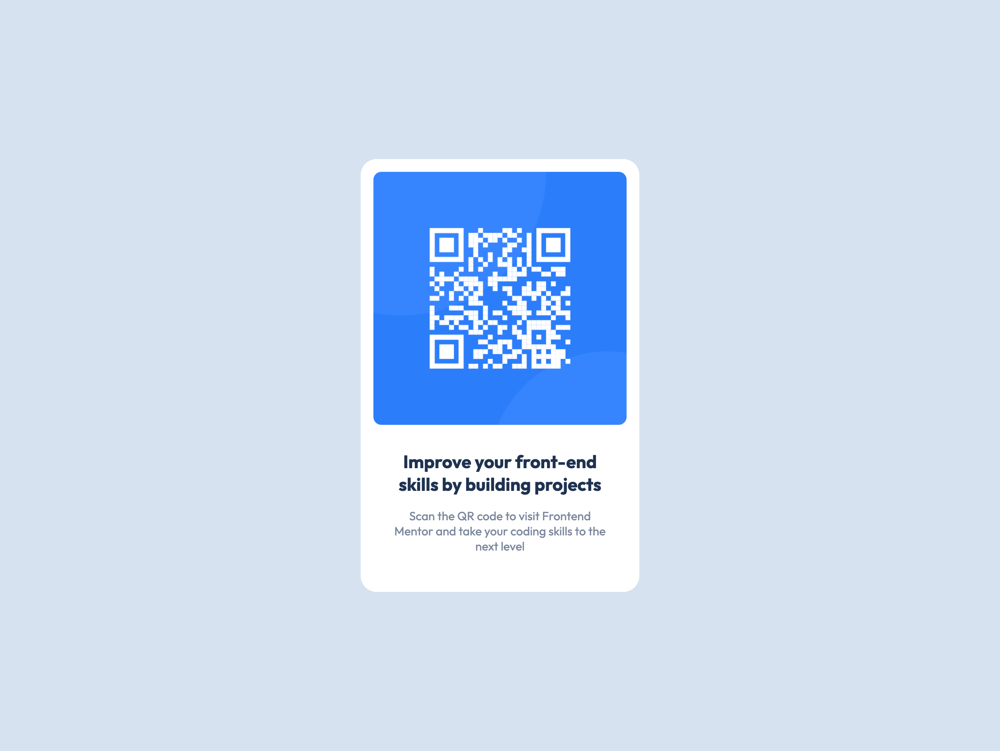

# Frontend Mentor - QR code component solution

This is a solution to the [QR code component challenge on Frontend Mentor](https://www.frontendmentor.io/challenges/qr-code-component-iux_sIO_H). Frontend Mentor challenges help you improve your coding skills by building realistic projects. 

## Table of contents

- [Overview](#overview)
  - [Screenshot](#screenshot)
  - [Links](#links)
- [My process](#my-process)
  - [Built with](#built-with)
  - [What I learned](#what-i-learned)
  - [Continued development](#continued-development)
- [Acknowledgments](#acknowledgments)

## Overview

### Screenshot

### Links

- Solution URL: [GitHub Repo](https://github.com/Daniel4hmed/QR-Component)
- Live Site URL: [GitHub Page](https://daniel4hmed.github.io/QR-Component/)

## My process

### Built with

- Semantic HTML5 markup
- CSS custom properties
- Flexbox
- Mobile-first workflow

### What I learned

- Making use of the `<main>` tag.
- Avoid using fixed units (`px`) and focus on `rem` units unless specified.

### Continued development

- I personally need to continue learning / making use of flexbox as I did get a little stuck on centering the component vertically.

## Acknowledgments

[PhoenixDev22](https://github.com/PhoenixDev22) for providing me feedback on this project!
